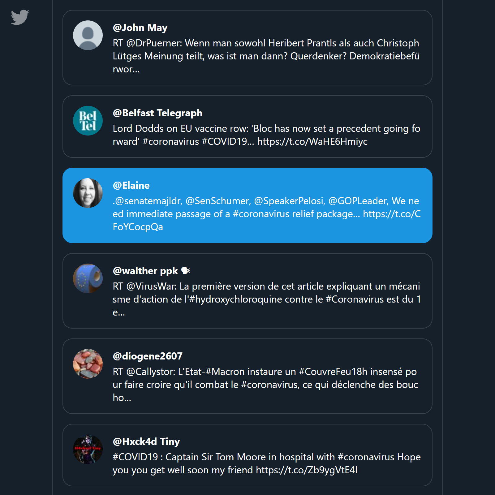

# React Twitter App (#coronavirus)

This is a small app that I used as a learning curve for both React Hooks and integrating the Twitter API. Twitter API is not public anymore, which means you have to implement your own server and follow the OAuth protocol. I elaborate on each side of the development below. As I previously described, this is not a full blown app, and although [Express.js](https://expressjs.com/) can definitely scale, it's worth considering a more structured framework, in the likes of [Nest.js](https://nestjs.com/).

## Server-side

To be able to retrieve posts from Twitter, I first had to venture through the Twitter API docs and so, I found out it's required to setup authentication against their authentication server in order to be able to make any kind of basic request to their resource API server. Since there's no user context in this case, I went on with OAuth 2.0 protocol, which means obtaining a bearer token, which in turn gets attached to every request we make to the resource API server, enabling us to retrieve the resource. See [Twitter Authentication](https://developer.twitter.com/en/docs/basics/authentication/oauth-2-0/application-only) for reference. To get the bearer token, you need to use your generated private keys, which means we must setup a server to use them privately (via `.env` file, which is obviously ignored by Git). To do all this, I decided to use [Express.js](https://expressjs.com/). I used their default CLI init command to scaffold the project, which outputs a nice, lean boilerplate. Then, all I had to do is define the necessary routes, one for retrieving the bearer token and another one for retrieving tweets. Once that's done, I integrated it with the client.

### Twitter OAuth 2.0 Illustration

## Client-side

For client-side I went with latest React, Styled Components and latest ECMAScript features. For state management, I went with no other than React [`useReducer`](https://reactjs.org/docs/hooks-reference.html#usereducer) hook, which makes it extremely easy to setup a miniature store and actions without excessive boilerplate. Upon load, the app will obtain an access token from the server and then fetch the first 20 tweets with a `#coronavirus` hashtag. It will then elegantly load more tweets as you scroll about two thirds of the page. Elaborated tests are included of course. Bonus: it's also responsive. 👌

## Preview

